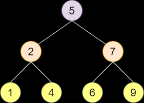

# Binary Search

<br>

| input | output |
| --- | --- |
| `n`: size of array <br> `arr[]`: sorted array of `n` elements <br> `x`: target element | `i`: index of target element |

<br>

## example :

```
input:
7
1 2 4 5 6 7 9
6

output:
4
```
<br>



<br>

## appraoch :

1. find the `middle` element

2. if `middle` element is larger than `target` element then look in *left subtree*

3. if `middle` element is smaller the `target` element then look in *right subtree*

4. if `middle` element is equal to `target` element then return the `index`

5. if `target` element is not found then return `-1` 

<br>

## implementation :

```python
def binarySearch(arr, size, target):
    l, r = 0, size-1

    while l <= r:
        m = l + (r - l) // 2
        
        if arr[m] == target:
            return m
        elif arr[m] > target:
            r = m - 1
        else:
            l = m + 1

    return -1

n = int(input())

arr = list(map(int, input().split()))

index = binarySearch(arr, n, int(input()))

print(index)
```

<br>

## recurrence relation :
```
T(n) = T(n / 2) + 1 , if n > 1
T(n) = 1 , if n = 1 
```

<br>

## time and space complexity :

T(n) = **O**(log(n))
<br>S(n) = **O**(1)
