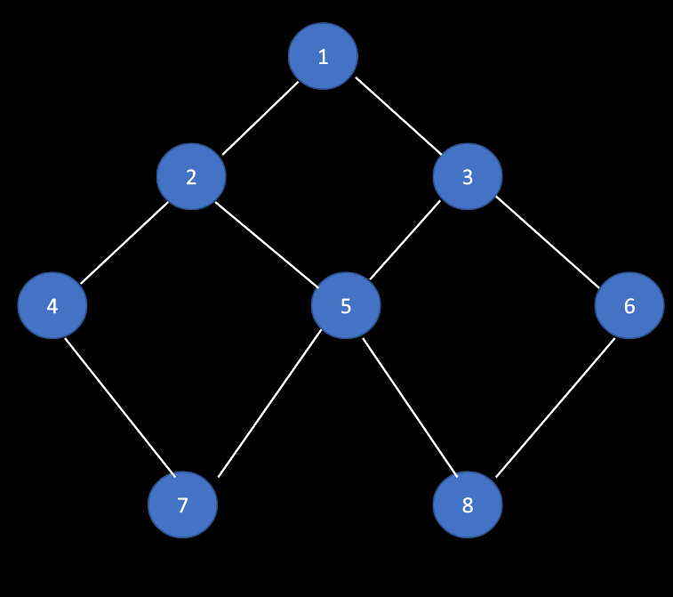

# Representation of Graph

* Adjacency Matrix
* Adjacency List

<br>



> Representation :

### Adjacency Matrix
```
   1  2  3  4  5  6  7  8
1 [1, 1, 1, 0, 0, 0, 0, 0]
2 [1, 1, 0, 1, 1, 0, 0, 0]
3 [1, 0, 1, 0, 1, 1, 0, 0]
4 [0, 1, 0, 1, 0, 0, 1, 0]
5 [0, 1, 1, 0, 1, 0, 1, 1]
6 [0, 1, 1, 0, 0, 1, 0, 1]
7 [0, 0, 0, 1, 1, 0, 1, 0]
8 [0, 0, 0, 0, 1, 1, 0, 1]
```

### Adjacency List

```
1 -> [2, 3]
2 -> [1, 4, 5]
3 -> [1, 5, 6]
4 -> [2, 7]
5 -> [2, 3, 7, 8]
6 -> [3, 8]
7 -> [4, 5]
8 -> [5, 6]
```
> When to use which representaion :

* When a graph is `dense` i.e. when most of the nodes are connected it is appropriate to use `adjacency matrix` representation.
* When a graph is `sparse` i.e. when only few of the nodes are connected it is appropriate to use `adjacency list` representaion.
* If adjacency list is drawn for `dense` *undireced graph* the maximum number of nodes in all the list can be `2 * E`
* If adjacency list is drawn for `dense` *direced graph* the maximum number of nodes in all the list can be `E` 
* If input is given in one form of representaion there is no sense in converting it to another form.


