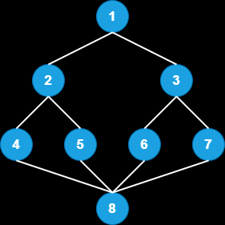

# Walk of Anger

Ellen had huge fight with her wife Portia, she stromed out of her house and wanted to spend outside as long as possible. So, she decided to take a walk to her neighbour, she want to visit her neighbour's houses and tell them what a b*tch her wife is and cry about it.

She can visit a house only once, because if she get to visit again the neighbours get annoyed and kick her off.

She can only visit house 'B' from 'A', only if its an adjacent neighbour of house 'A'.
If `t` is the time taken by Ellen on each house, find the longest duration she can stay away from her wife.

<br>

## Figure :



In  neighbourhood G, 2 and 3 are neighbours of 1, and 1, 4 and 5 are neighbours of 2 and so on . . .

<br>

## Input format :

The first line contain two space-separated integes `n` and `t`.

Next `n` line contains house `i` and its neighbours where `i` ranges from `1` to `n`.

<br>

## Constraints :

1 <= n <= 10<sup>5</sup>

1 <= t <= 30

<br>

## Output format :

A single integer denoting the time spend by Ellen away form her wife.

<br>

## Example :

```js
let n = 8, t = 1;

let neighbour = {
    1: [2, 3],
    2: [1, 4, 5],
    3: [1, 6, 7],
    4: [2, 8],
    5: [2, 8],
    6: [3, 8],
    7: [3, 8],
    8: [4, 5, 6, 7]
};

console.log(walkOfAnger(n, t, neighbour)); //6

n = 5, t = 10;
neighbour = {1: [2],
    2: [3],
    3: [4], 
    4: [5],
    5: []
}

console.log(walkOfAnger(n, t, neighbour)); //40
```

<br>

## Implementation :

```js
function DFS(v, neighbour, visited, level){
    let maxDepth = 0;
    visited[v] = 1;

    for(let adj of neighbour[v]){
        if(visited[adj] == 0){
            maxDepth = Math.max(DFS(adj, neighbour, visited, level + 1), level);
        }
    }

    return Math.max(maxDepth, level);
}

function walkOfAnger(houseCount, timeSpent, neighbour){
    let visited = new Array(houseCount + 1).fill(0);
    let houseVisited =  DFS(1, neighbour, visited, 0);
    return houseVisited * timeSpent;
}
```

<br>

## Time and Space complexity :

T(n) = **O**(n<sup>2</sup>)
<br>S(n) = **O**(n)