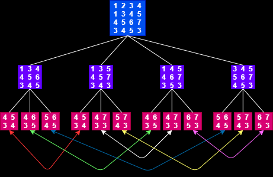

# Determinant of a matrix 

| input | output |
| --- | --- |
| `n`: size of matrix <br> `arr[][]`: `n` x `n` matrix | `d`: determinant of matrix |

<br>

## example :

```
input:
4
1 2 3 4
1 3 4 5
4 5 6 7
3 4 5 3

output:
9
```

<br>



* Number of nodes at root = `1` *( <sup>4</sup>C<sub>4</sub> )*

* Number of nodes at level 1 = `4` *( <sup>4</sup>C<sub>4</sub> x <sup>4</sup>C<sub>3</sub> )*

* Number of nodes at level 2 = `12` *( <sup>4</sup>C<sub>4</sub> x <sup>4</sup>C<sub>3</sub> x <sup>4</sup>C<sub>2</sub> )*

* Total number of operation require to calculate the determinant is <sup>4</sup>C<sub>4</sub> + <sup>4</sup>C<sub>4</sub> x <sup>4</sup>C<sub>3</sub> + <sup>4</sup>C<sub>4</sub> x <sup>4</sup>C<sub>3</sub> x <sup>4</sup>C<sub>2</sub> = 1 + 1 * 4 + 1 * 4 * 3 = 1 + 4 + 12 = 17

* In general this can be written as <sup>n</sup>C<sub>n</sub> + <sup>n</sup>C<sub>n</sub> x <sup>n</sup>C<sub>n-1</sub> + <sup>n</sup>C<sub>n</sub> x <sup>n</sup>C<sub>n-1</sub> x <sup>n</sup>C<sub>n-2</sub> + . . . . `< n!`

<br>

## approach 1 :
### using recursion

1. base conditions :
    * if size of matrix is 1 :
        * return `matrix[0]`
    * if size of matrix is 2 :
        ```
        [[a, b],
         [c, d]]
        ```
        * return `a * d - b * c`

2. initialize determinat to `0`

3. iterate through first row and find `cofactor` for each `column`
    * for `column` in range (`0` to `size`) :
        *  find `cofactor` for current `column `element by calling the function recusively and passing the submatrix of `size` - 1 
        <br>
        *(the submatix excludes the current column)*
        * multiply the current `column` element with it's `cofactor`
        * add the result to `determinant` with appropriate **sign**
        <br>
        *[ sign = (-1)<sup> column</sup> ]*

4. return `determinant`

<br>

## implementation :

```python
def cofactor(matrix, column, size):
    trim = []

    for i in range(1, size):
        temp = []
        
        for j in range(size):
            if j == column:
                continue
            
            temp.append(matrix[i][j])
        
        trim.append(temp)    
    
    return trim

def determinant(matrix, size):
    if size == 1:
        return matrix[0]
    
    if size == 2:
        return matrix[0][0] * matrix[1][1] - matrix[1][0] * matrix[0][1]
    
    det = 0

    for i in range(size):
        temp = matrix[0][i] * determinant(cofactor(matrix, i, size), size - 1) 
        det += ((-1) ** i) * temp
    
    return det

n = int(input())

matrix = []
for _ in range(n):
    row = list(map(int, input().split()))
    matrix.append(row)

print(determinant(matrix, n))
```

<br>

## time and space complexity :
T(n) = **O**(n!)
<br>S(n) = **O**(n)