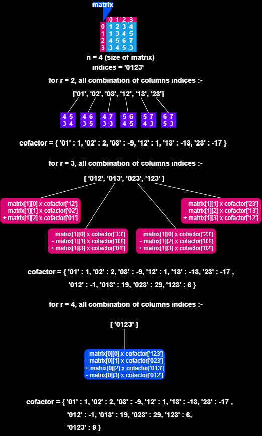

# Determinant of a matrix 

| input | output |
| --- | --- |
| `n`: size of matrix <br> `arr[][]`: `n` x `n` matrix | `d`: determinant of matrix |

<br>

## example :

```
input:
4
1 2 3 4
1 3 4 5
4 5 6 7
3 4 5 3

output:
9
```

<br>

### using recursion :


* number of nodes at root = `1` *( <sup>4</sup>C<sub>4</sub> )*

* number of nodes at level 1 = `4` *( <sup>4</sup>C<sub>4</sub> x <sup>4</sup>C<sub>3</sub> )*

* number of nodes at level 2 = `12` *( <sup>4</sup>C<sub>4</sub> x <sup>4</sup>C<sub>3</sub> x <sup>4</sup>C<sub>2</sub> )*

* total number of operation require to calculate the determinant is <sup>4</sup>C<sub>4</sub> + <sup>4</sup>C<sub>4</sub> x <sup>4</sup>C<sub>3</sub> + <sup>4</sup>C<sub>4</sub> x <sup>4</sup>C<sub>3</sub> x <sup>4</sup>C<sub>2</sub> = 1 + 1 * 4 + 1 * 4 * 3 = 1 + 4 + 12 = 17

* in general this can be written as <sup>n</sup>C<sub>n</sub> + <sup>n</sup>C<sub>n</sub> x <sup>n</sup>C<sub>n-1</sub> + <sup>n</sup>C<sub>n</sub> x <sup>n</sup>C<sub>n-1</sub> x <sup>n</sup>C<sub>n-2</sub> + . . . . < **n!**

<br>

## approach 1 :

1. base conditions :
    * if size of matrix is 1 :
        * return `matrix[0][0]`

2. initialize determinat to `0`

3. iterate through first row and find `cofactor` for each `column`
    * for `column` in range (`0` to `size`) :
        *  find `cofactor` for current `column `element by calling the function recusively and passing the submatrix of `size` - 1 
        <br>
        *(the submatix excludes the current column)*
        * multiply the current `column` element with it's `cofactor`
        * add the result to `determinant` with appropriate **sign**
        <br>
        *[ sign = (-1)<sup> column</sup> ]*

4. return `determinant`

<br>

## implementation :

```python
def cofactor(matrix, column, size):
    trim = []

    for i in range(1, size):
        temp = []
        
        for j in range(size):
            if j == column: continue
            
            temp.append(matrix[i][j])
        
        trim.append(temp)    
    
    return trim

def determinant(matrix, size):
    if size == 1:
        return matrix[0][0]
    
    det = 0

    for i in range(size):
        temp = matrix[0][i] * determinant(cofactor(matrix, i, size), size - 1) 
        det += ((-1) ** i) * temp
    
    return det

n = int(input())

matrix = []
for _ in range(n):
    row = list(map(int, input().split()))
    matrix.append(row)

print(determinant(matrix, n))
```

<br>

## time and space complexity :
T(n) = **O**(n!)
<br>S(n) = **O**(n)

<br>

---
<br>

## example :
### using dynamic programming (bottom up method)



* the main computational cost is to calculate the  combination of column indices ( <sup>n</sup>C<sub>r</sub> )

* for above example the cost is <sup>4</sup>C<sub>4</sub> + <sup>4</sup>C<sub>3</sub> + <sup>4</sup>C<sub>2</sub> = 1 + 4 + 6 = 11

* in general this can be written as <sup>n</sup>C<sub>n</sub> + <sup>n</sup>C<sub>n-1</sub> + <sup>n</sup>C<sub>n-2</sub> + . . . . + <sup>n</sup>C<sub>2</sub> < **2<sup>n</sup>**

<br>

## approach 2 :

1. initialize `indices` to string containing index from `0` to `size`
    * *(if size of matrix is 4x4 then, indices = '0123')*

2. find all `combination` of `columns` with the help of `indices`
    * for r in range (`2` to `size`) :
        * find <sup>n</sup>C<sub>r</sub> of column indices
        * find determinant for each sub-matrix and store it into `cofactor` hash
        * for determinant of matrix of `size` > `2` the `cofactors` can be directly obtained from hash

3. return the `determinant` of matrix

<br>

## implementation :

```python 
from itertools import combinations

def nCr(string, n):
    result = []
    
    for comb in list(combinations(string, n)):
        result.append(list(map(int, comb)))
    
    return result

def determinant(matrix, size):
    indices = ''.join([str(i) for i in range(size)])
    
    cofactor = {}
    
    for r in range(2, size + 1):
        combination = nCr(indices, r)
        i = n - r
        
        if r == 2:
            for column in combination:
                det = 0
                [j, k] = column
                det += matrix[i][j] * matrix[i+1][k] - matrix[i+1][j] * matrix[i][k]
                cofactor[''.join(map(str, column))] = det
        else:
            for column in combination:
                det = 0
                for j in column:
                    co = ''.join(map(str, column)).replace(str(j), '')
                    det += ((-1) ** column.index(j)) * matrix[i][j] * cofactor[co]
                    
                cofactor[''.join(map(str, column))] = det 
    
    return cofactor[indices]
        

n = int(input())

matrix = []
for _ in range(n):
    row = list(map(int, input().split()))
    matrix.append(row)

print(determinant(matrix, n))
```

<br>

## time and space complexity :
T(n) = **O**(2<sup>n</sup>)
<br>S(n) = **O**(2<sup>n</sup>)
